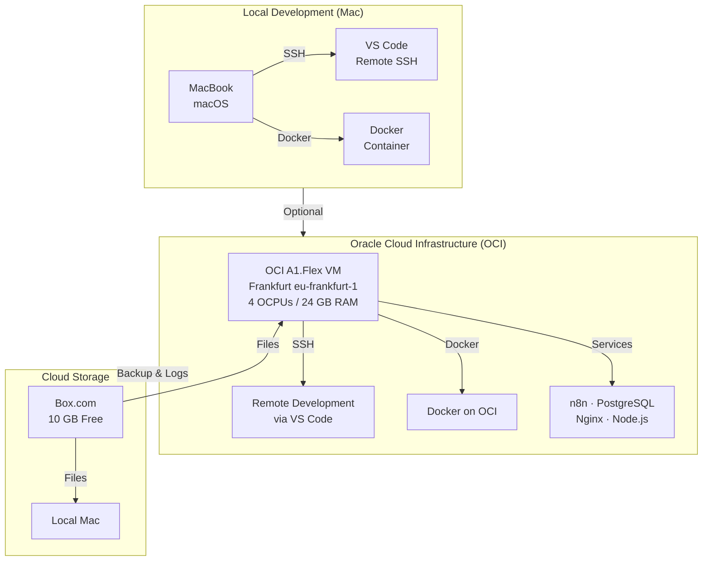

# OpenSIN Development Environment Setup

  

  <a href="#quick-start">Quick Start</a> ·
  <a href="#features">Features</a> ·
  <a href="#architecture">Architecture</a> ·
  <a href="#setup-guides">Setup Guides</a> ·
  <a href="#cloud-storage">Cloud Storage</a> ·
  <a href="#contributing">Contributing</a>

  
  
  
  
  

> Dein Development Environment für das **OpenSIN-AI Ökosystem** — lokal auf macOS, in der Cloud auf Oracle Cloud Infrastructure (OCI), oder containerisiert mit Docker. Alles was du brauchst, um als Developer sofort produktiv zu sein.

---

## What is this?

Dieses Repository ist das **zentrale Setup-Dokumentationssystem** für alle OpenSIN-AI Entwickler. Es beschreibt Schritt für Schritt, wie du deine Entwicklungsumgebung aufsetzt — egal ob auf deinem **Mac** (macOS), auf einer **Cloud-VM** (Oracle Cloud Always-Free A1.Flex), oder in **Docker**.

**Damit bist du in 30 Minuten startklar:**
- ✅ macOS Dev Environment mit allen Tools (Homebrew, Git, Node.js, Python, Docker)
- ✅ Kostenlose OCI A1.Flex Cloud-VM (4 OCPUs, 24 GB RAM) in Frankfurt
- ✅ Box.com Cloud Storage (10 GB free) für Logs, Screenshots, Backups
- ✅ Docker Container für isolierte Entwicklung

---

## Quick Start

<table width="100%">
<tr>
<td width="33%" align="center">
<strong>1. macOS Setup</strong>  
<code>bash setup-mac.sh</code>  

</td>
<td width="33%" align="center">
<strong>2. OCI VM (optional)</strong>  
<a href="OCI-dev-setup.md"><code>Oracle Cloud Guide →</code></a>  

</td>
<td width="33%" align="center">
<strong>3. Docker (optional)</strong>  
<a href="opencode-docker-build/"><code>Docker Guide →</code></a>  

</td>
</tr>
</table>

> [!TIP]
> Für die OCI-VM brauchst du **keine Kreditkarte** wenn du die Always-Free-Limits einhältst (4 OCPUs, 24 GB RAM, 50 GB Storage) — komplett kostenlos, dauerhaft.

---

## Features

| Capability | Description | Status |
|:---|:---|:---:|
| **macOS Dev Setup** | Vollständige Anleitung für MacBook/Mac-Entwicklungsumgebung | ✅ |
| **OCI A1.Flex Guide** | Schritt-für-Schritt Oracle Cloud Account + VM Erstellung | ✅ |
| **Docker Integration** | Containerisierte Entwicklung mit Docker & Docker Compose | ✅ |
| **Cloud Storage** | Box.com + Google Drive Integration (10 GB free) | ✅ |
| **SSH Remote Dev** | VS Code Remote-SSH für OCI-VM Entwicklung | ✅ |
| **OpenCode CLI** | Installation und Konfiguration der OpenCode CLI | ✅ |
| **GitHub Workflows** | CI/CD Templates und Automatisierungen | ✅ |
| **Firewall Setup** | OCI Netzwerk- und Port-Konfiguration | ✅ |

---

## Architecture

> [!NOTE]
> Die OCI-VM läuft in **Frankfurt (`eu-frankfurt-1`)** mit 3 Availability Domains — dadurch ist die Verfügbarkeit für Always-Free A1.Flex besser als in anderen Regionen. Falls AD1 voll ist, einfach AD2 oder AD3 versuchen.

---

## Setup Guides

### macOS Development Environment

Vollständige Anleitung zur Einrichtung deines Mac als Development Machine.

<a href="macOS-dev-setup.md">📖 macOS Setup Guide lesen →</a>

**Enthält:**
- Homebrew Installation
- Git, Node.js (Bun!), Python, Docker
- SSH Key Setup für GitHub und OCI
- macOS Terminal Optimierung

Was wird installiert?

| Tool | Category | Purpose |
|:---|:---|:---|
| **Homebrew** | Paketmanager | Pakete & Apps installieren |
| **Git** | Versionskontrolle | Code verwalten |
| **Bun** | Runtime | Node.js Alternative (schneller, weniger RAM) |
| **Python 3** | Sprache | Für Scripts und Automatisierung |
| **Docker** | Container | Isolierte Entwicklungsumgebungen |
| **VS Code** | Editor | Code schreiben mit Remote-SSH Extension |

---

### Oracle Cloud Infrastructure (OCI)

Schritt-für-Schritt Anleitung für die Einrichtung einer kostenlosen OCI A1.Flex VM in Frankfurt.

<a href="OCI-dev-setup.md">📖 OCI Setup Guide lesen →</a>

**Enthält:**
- Oracle Cloud Free Tier Account erstellen
- A1.Flex Instance erstellen (4 OCPUs, 24 GB RAM — kostenlos!)
- SSH Key Konfiguration
- Ubuntu 22.04/24.04 LTS Setup
- PAYGO-Workaround bei Kapazitätsproblemen
- Budget Alert setzen

OCI Always-Free Limits

| Ressource | Always-Free-Limit |
|:---|:---|
| OCPUs | 4 |
| RAM | 24 GB |
| Boot Volume | 50 GB |
| Traffic Out | 10 TB/Monat |

Solange du innerhalb dieser Limits bleibst → **kostenlos, solange du willst**.

---

### Docker Development

Containerisierte Entwicklung mit Docker und Docker Compose.

<a href="opencode-docker-build/">📖 Docker Setup Guide →</a>

---

### OpenCode CLI

Installation und Konfiguration der OpenCode CLI — dem zentralen Tool für alle A2A-Agenten.

<a href="opencode-dev-setup.md">📖 OpenCode CLI Setup →</a>

---

## Cloud Storage

OpenSIN nutzt **Box.com** (10 GB free) als primären Cloud Storage für alle Dateien — Logs, Screenshots, Backups, und mehr.

| Storage | Shared Link | Purpose |
|:---|:---|:---|
| **Public Files** | [Box.com Public](https://app.box.com/s/1st624o9eb5xdistusew5w0erb8offc7) | Logos, Bilder, Docs — öffentlich |
| **Cache** | [Box.com Cache](https://app.box.com/s/9s5htoefw1ux9ajaqj656v9a02h7z7x1) | Logs, Cache, temporäre Files |

> [!IMPORTANT]
> Alle Logs, Screenshots und Debug-Artefakte werden **nicht mehr lokal gespeichert**, sondern automatisch in Box.com hochgeladen. Das schützt vor Datenverlust und ermöglicht teamübergreifenden Zugriff.

→ **[Komplette Box Storage Doku](box-storage.md)**

---

## Repository Structure

| File/Directory | Purpose |
|:---|:---|
| [`README.md`](README.md) | Diese Datei — Überblick und Quick Start |
| [`macOS-dev-setup.md`](macOS-dev-setup.md) | macOS Development Environment Setup |
| [`OCI-dev-setup.md`](OCI-dev-setup.md) | Oracle Cloud Infrastructure Setup |
| [`opencode-dev-setup.md`](opencode-dev-setup.md) | OpenCode CLI Installation |
| [`opencode-docker-build/`](opencode-docker-build/) | Docker Container Konfigurationen |
| [`box-storage.md`](box-storage.md) | Box.com & Google Drive Integration |
| [`github/`](github/) | GitHub Workflows und Templates |
| [`SECURITY.md`](SECURITY.md) | Security Policy |
| [`CONTRIBUTING.md`](CONTRIBUTING.md) | Contributing Guidelines |
| [`CHANGELOG.md`](CHANGELOG.md) | Versionshistorie |

---

## Related Repositories

| Repo | Description |
|:---|:---|
| [OpenSIN-onboarding](https://github.com/OpenSIN-AI/OpenSIN-onboarding) | End-User Onboarding — für neue Team-Mitglieder |
| [OpenSIN-documentation](https://github.com/OpenSIN-AI/OpenSIN-documentation) | Komplette Projektdokumentation |
| [OpenSIN-overview](https://github.com/OpenSIN-AI/OpenSIN-overview) | Organisations-Überblick und Team-Struktur |
| [Infra-SIN-Docker-Empire](https://github.com/OpenSIN-AI/Infra-SIN-Docker-Empire) | Docker-Infrastruktur für Produktion |
| [upgraded-opencode-stack](https://github.com/OpenSIN-AI/upgraded-opencode-stack) | Global Brain & System Directives für OpenCode |

---

## Contributing

Beiträge sind willkommen! Bitte lies die [Contributing Guidelines](CONTRIBUTING.md) bevor du Änderungen einreichst.

**So contributest du:**

1. Fork das Repository
2. Erstelle einen Feature-Branch (`git checkout -b feature/amazing-feature`)
3. Commite deine Änderungen (`git commit -m 'Add amazing feature'`)
4. Push zum Branch (`git push origin feature/amazing-feature`)
5. Öffne einen Pull Request

> [!NOTE]
> Für Issues und Bugs nutze bitte die [GitHub Issues](https://github.com/OpenSIN-AI/dev-setup/issues) —清清楚楚描述问题, steps to reproduce, und expected vs actual behavior.

---

## License

Distributed under the **Apache 2.0 License**. See [LICENSE](LICENSE) for more information.

---

  

  Entwickelt vom <a href="https://opensin.ai"><strong>OpenSIN-AI</strong></a> Ökosystem – Enterprise AI Agents die autonom arbeiten. 
  🌐 <a href="https://opensin.ai">opensin.ai</a> · 💬 <a href="https://opensin.ai/agents">Alle Agenten</a> · 🚀 <a href="https://opensin.ai/dashboard">Dashboard</a>

(<a href="#readme-top">back to top</a>)
